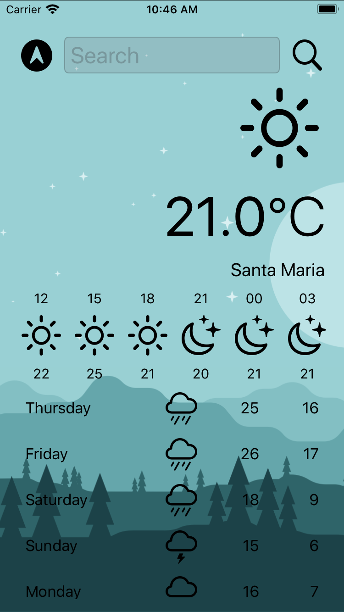
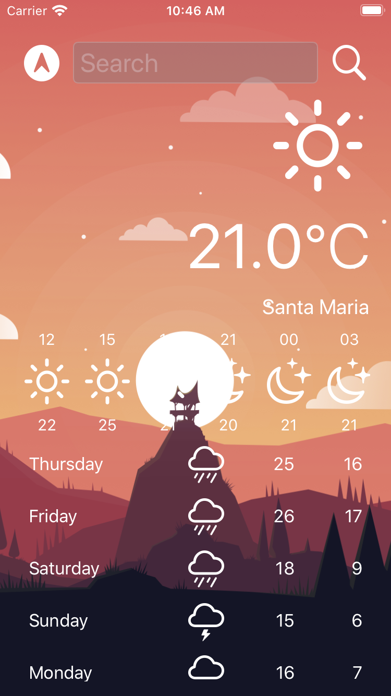

# Clima
O App Clima é um aplicativo de previsão tempo que utiliza a api openweathermap.
Com o App é possivel obter a previsão do tempo local e fazer buscas por qualquer cidade no mundo.

# Caracteristicas
* Condições do tempo agora.
* Previsão do tempo para as próximas 24h.
* Previsão do tempo para os próximos 5 dias.
* Para obter a previsão local utiliza-se o GPS.
* API openweathermap.
* AutoLayout.
* Utilizado apenas recursos nativos do swift (nem uma biblioteca externa).

<h1 align="center">
Captura de tela modo claro e escuro
<h1>
<h2 align="center">

</h2>

# Obs.:
Foi utilizado apenas a api free do openweathermap e por isso os dados são esparsos em 3 em 3 horas para a previsão das proximoas horas do dia atual. 
E para a previsão dos próximos dias também utilizou-se a api free e por isso só foi possível obter a previsão dos próximos 5 dias.

## 📌 Support

- Twitter at [@fbw_] (https://twitter.com/fbw_)
- Instagram at [@felipeweber] (https://www.instagram.com/felipeweber)
- Linkedin at [@felipebweber] (https://www.linkedin.com/in/felipebweber)
- Twitch at [@felipebweber] (https://www.twitch.tv/felipebweber)

## 📧 Contact

- Email at weberecomp@gmail.com

## 📝 License

This project is licensed under the MIT License - see the [LICENSE](LICENSE) file for details.